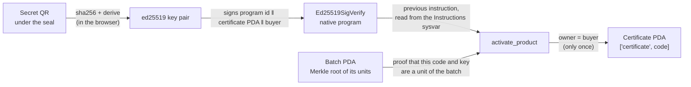

# VeriFire

**Verifiable product authenticity and warranties on Solana.** A company registers each unit it sells with two QR codes;
anyone can check who issued a product, and the buyer activates the warranty with a wallet, so the warranty and the
ownership live on-chain and follow the product when it is resold.

- Live demo: **https://verifire-solana.cosmosapp.lat** (English landing at `/en/`)
- Anchor program: [`solana/programs/verifire_product`](solana/programs/verifire_product), on **Solana devnet**. No real
  money moves.

## For evaluators

- **Program on Solana devnet:** [`6a6EMSNxCrFzcLA38Q5WwcPWgyDPqdghaoaWhvHAEnj8`](https://explorer.solana.com/address/6a6EMSNxCrFzcLA38Q5WwcPWgyDPqdghaoaWhvHAEnj8?cluster=devnet).
  Its transaction history shows the deploy, `initialize`, three `mint_product` (the first version, with one account
  per product), two `activate_product` (each one next to its `Ed25519SigVerify` instruction) and one `offer_transfer`.
  The current version registers a whole batch in one account (`register_batch`); see [Cost per unit](#cost-per-unit).
- **Where Solana does the work:** [`lib.rs`](solana/programs/verifire_product/src/lib.rs) (instructions and accounts),
  [`ed25519.rs`](solana/programs/verifire_product/src/ed25519.rs) (reading the signature check from the Instructions
  sysvar), [`src/lib/server/solana.ts`](src/lib/server/solana.ts) (transactions and fee sponsorship) and
  [`docs/solana-architecture.md`](docs/solana-architecture.md) (design, security and pending work).
- **Tests:** `npm run test:solana` (the program, natively) and `npm test` (TypeScript, with vectors shared with Rust).

### How the sealed QR proves ownership



The secret never travels in a transaction: when a batch is registered, the program stores only the Merkle root of its
units, each leaf committing to a unit's public code and the public key derived from its secret. Because the signed
message includes the buyer's address, a copied activation cannot be replayed for someone else, and once the certificate
exists a second activation is refused.

### What a copied label looks like

A public QR is a printed code, so it can be photocopied. What a copy cannot do is activate the product a second time or
be in two places at once. The public page (`/verify`) shows the unit's state (sealed or activated, activation date,
coverage and how many owners it has had) and warns the buyer when:

- someone tried to activate it with its secret QR after it already had an owner, or
- its public QR was checked from two different countries within 48 hours.

The rules live in [`src/lib/scan-signals.ts`](src/lib/scan-signals.ts) and are covered by
[`tests/scan-signals.test.mjs`](tests/scan-signals.test.mjs).

### Built during the hackathon

The first prototype (September 2026) ran on another chain. On October 3 the on-chain layer was rebuilt from scratch on
Solana: the Anchor program, its native tests, the Privy embedded wallets, fee sponsorship and Solana Pay batch payments.
The web app (company panel, buyer panel, public pages and translations) was carried over and adapted. The full history
is in the git log.

## The problem

When you buy electronics, watches, perfume or wine, you have to take the seller's word that the product is genuine and
that the warranty is real. A warranty is usually a paper or a message that gets lost, a claim can be faked, and when
the product is resold the record does not travel with it. Nobody outside the seller can check the history, and the
seller can change it afterwards.

## The solution

Each unit gets **two QR codes** and a leaf in its batch's Merkle tree in the VeriFire Anchor program; when the buyer
activates it, it gets its own account (its certificate):

| QR | Where it goes | Who scans it | What it does |
| --- | --- | --- | --- |
| **Public QR** | Outside the product | Anyone, before or after buying | Opens `/verify`: model, batch, destination, state, and **who issued it** |
| **Secret QR** | Under a seal, inside the box | The buyer, once | Activates the warranty and makes the buyer's wallet the on-chain owner |

- The secret never travels in a transaction. The program stores only the ed25519 public key derived from it; the
  buyer's browser signs with it a message bound to the program, the product and the buyer's own address, so nobody can
  front-run the activation.
- The buyer needs **no SOL and no crypto knowledge**: signing in with an email or Google creates a Privy embedded
  wallet, and Verifire pays the network fees as the transaction's fee payer.
- The owner can hand the warranty to someone else with a **transfer link** (valid 15 minutes, single use), so a resold
  product keeps its proof. The short window limits the damage of a leaked link; both people have to be connected at the
  same moment, and the owner can open a new link if it expires.
- A public QR says **"Original product"** only if the issuer was **verified by a Verifire administrator**; otherwise it
  says **"Registered product"** and that the issuer was not verified. Verifire guarantees that a code is unique and was
  not copied. That the product is genuine is vouched for by the verified company that issued it.

## How it works: step by step for each user

### Company (the issuer)
1. Sign up, choose the company workspace and fill in the profile (legal name, tax ID, website).
2. Buy a batch of tokens at `/admin`, paying in USDC with **Solana Pay**: scan the QR with any Solana wallet, or pay
   from the Verifire wallet in one click.
3. When the payment is confirmed on-chain, the server registers the whole batch in the program with one transaction
   (`register_batch`).
4. Print the labels (public QR outside, secret QR inside) and mark the batch as shipped from the batches panel.
5. Ask for verification from Settings → Verification. Until an administrator approves it, its products show as "registered".

### Verifire administrator
1. Sign in with a wallet listed in `ADMIN_WALLETS` and open `/verificacion`.
2. Review what each company declared (legal name, tax ID, website) and approve or reject it, signing with the wallet.
3. The approval stores the business name that was checked and only holds while the company keeps showing that name.

### Anyone in a shop (before buying)
1. Scan the public QR: `/verify?token=VF-XXXXXXXX` shows the product and its issuer, with no app and no account.

### Buyer
1. Scan the secret QR in `/app` and sign in (email or Google). A Privy wallet is created if there is none.
2. Sign the activation. The warranty is registered on Solana and the buyer gets a public certificate (the transaction
   on Solana Explorer).
3. Optionally allow the product to appear in the home page carousel (only products of verified companies can).
4. From "My warranties", open a transfer link to give the product to someone else.

### New owner
1. Open the transfer link, sign in, sign the acceptance. The program moves the ownership and the warranty.

## Why Solana

- **The proof is checked on-chain, natively.** Solana verifies ed25519 signatures with its native `Ed25519SigVerify`
  program. VeriFire's program reads that check through the Instructions sysvar, so the secret QR's signature, the
  buyer's signature and the rule "activate only once" are enforced by the network, not by our server.
- **One account per batch, one per activated product.** A batch is a single PDA holding the Merkle root of its units,
  so a sealed unit costs no rent. Activating one creates its certificate, a 98-byte PDA seeded by its public code (the
  code is unique by construction) that anyone can read with a single RPC call. See [Cost per unit](#cost-per-unit).
- **Fees are tiny and sponsored.** Verifire is the fee payer of every user transaction, so buyers and companies never hold
  SOL. Before co-signing, the server rebuilds the exact message it expects and refuses anything else.
- **Payments and wallets are native.** Batches are paid in USDC with Solana Pay from any Solana wallet, and Privy gives
  every user an embedded Solana wallet from an email or a Google account.
- **Anyone can audit it.** Every registration, activation and transfer is a transaction that opens in Solana Explorer,
  and the program emits an event for each of them.

## Install, run and test

Requires Node 22.18 or newer. The program needs Rust; deploying it needs the Solana CLI and Anchor 1.2
(`avm install 1.2.0`).

```bash
npm install
cp .env.example .env   # fill in the Solana, Solana Pay and Privy values
npm run dev            # http://localhost:5501
```

Deploy the program to devnet once:

```bash
cd solana
anchor build
anchor keys sync                       # writes your program id into lib.rs and Anchor.toml
anchor deploy --provider.cluster devnet
cd .. && npm run solana:init           # creates the config: admin, minter and transfer-link cooldown
```

| Script | What it does |
| --- | --- |
| `npm run dev` | Development server |
| `npm run check` | Type check for `.astro`, `.ts` and `.tsx` |
| `npm test` | Pure-logic tests (`node --test`), including vectors shared with the program |
| `npm run test:solana` | The program's tests, run natively with `solana-program-test` |
| `npm run build` | Type check, tests and production build into `dist/` |
| `npm start` | Production server (reads `.env` on start) |
| `npm run solana:init` | Initializes the deployed program (only its upgrade authority can) |

Without `SOLANA_PROGRAM_ID` the app runs in **demo mode**: warranties are stored only locally and the interface says
so. Set the program and the server's keypair to make them real.

**Try it without installing:**
1. Open a public verification page: `https://verifire-solana.cosmosapp.lat/verify?token=<public code>`, with the code printed on any public QR.
2. Sign up at `/login?modo=registro`, choose the company workspace and follow the company steps above.
3. To see the carousel on the home page, a Verifire administrator has to approve the company that issued the products.
4. **Or activate a real one yourself:** [`docs/demo-qrs/`](docs/demo-qrs/) has six sealed, unclaimed demo products,
   each with its public and secret QR ready to use, and instructions for both.

**Videos:** [full demo walkthrough](PITCH/video-demo.md) and [an external user activating a product with no help from
the team](PITCH/video-external-user.md).

## Verifiable on-chain evidence

All of this is on Solana **devnet**.

| What | Value |
| --- | --- |
| VeriFire program | [`6a6EMSNxCrFzcLA38Q5WwcPWgyDPqdghaoaWhvHAEnj8`](https://explorer.solana.com/address/6a6EMSNxCrFzcLA38Q5WwcPWgyDPqdghaoaWhvHAEnj8?cluster=devnet) |
| Treasury (receives Solana Pay payments in USDC) | [`8gE8ezEXR7TWMKjub4ZsEXJihVLqfevYwLyaTHtFZUVK`](https://explorer.solana.com/address/8gE8ezEXR7TWMKjub4ZsEXJihVLqfevYwLyaTHtFZUVK?cluster=devnet) |
| Fee payer and minter (pays fees, signs registrations) | The fee payer of the program's `mint_product` and `register_batch` transactions in the explorer above |

The program id is also declared in [`lib.rs`](solana/programs/verifire_product/src/lib.rs) (`declare_id!`) and in
[`Anchor.toml`](solana/Anchor.toml).

Each activated product shows its own "View on Solana" link on its warranty card and history. The app only shows a
certificate link when a real transaction exists.

## Roadmap and future work

Planned, not built yet:

- **Simple mode for small sellers.** Today's company panel (batches, team, profile) is made for companies. Repair shops,
  resellers and small shops need "register a unit in three taps" from the phone.
- **Distributors and chain of custody.** Let a brand invite distributors who receive and hand over batches, so the
  history shows brand → distributor → shop → buyer, and diverted stock becomes visible.
- **Automatic company checks.** Validate the tax ID format and confirm the website with a signed file served from the
  company's domain, so the administrator reviews less by hand.
- **More flexible identifiers**, for example serial numbers of products that ship without a box.
- **A real database** in place of the JSON file, before the number of companies grows.
- **Mainnet** once the program has been audited, with its upgrade authority and admin in a Squads multisig.
- **Compressed NFTs** (Bubblegum) for brands that want each unit to show up as a collectible in the buyer's wallet.
- **Manufacturers and official importers** as issuers, so "original" can mean "from the factory", which today is
  only vouched for by the verified company that issues the product.

## Architecture, stack and technical details

### Stack

- [Astro 7](https://docs.astro.build) with `server` output and the `@astrojs/node` adapter (standalone mode).
- React 19 islands in TSX for the interactive parts, with state shared between islands through `nanostores`.
- Strict TypeScript (`astro/tsconfigs/strictest`) across the project.
- Typed configuration with `astro:env`, the Astro Fonts API and Font Awesome icons served locally. Tailwind through Vite (`tw:` utilities, no Preflight).
- Anchor 1.2 program in Rust at `solana/programs/verifire_product`, with native tests and vectors shared with TypeScript.
- `@solana/kit` on the server, Privy for sign-in and embedded wallets, Solana Pay (USDC) for batch payments, Resend for
  team invitations (optional).
- A JSON file as the store (written atomically, previous version kept as `<DATA_FILE>.bak`).

### Program

Design, security decisions and pending work: [`docs/solana-architecture.md`](docs/solana-architecture.md).

`initialize` (upgrade authority only), `update_config`, `register_batch` (minter), `import_claimed_product` (admin),
`activate_product`, `offer_transfer`, `cancel_transfer` and `accept_transfer`. Each batch is a PDA `["batch", code]`
with the Merkle root of its units, each activated product a PDA `["certificate", code]`, and the config a PDA
`["config"]` with separate admin and minter keys. Activation also requires the Merkle proof of the unit, and activation
and acceptance require an
`Ed25519SigVerify` instruction right before them, checked through the Instructions sysvar; transfer links always expire
and can only be reopened after a cooldown. Every operation emits an event. Error codes and the signed message format are
in `solana/programs/verifire_product/src/lib.rs`.

### Cost per unit

Rent on Solana is `(128 + bytes) × 6,960` lamports per account, and every signature pays a 5,000-lamport fee. Verifire
pays both.

| | First version (one account per product) | Now (one account per batch) |
| --- | --- | --- |
| Registering a batch | 619 bytes per unit: **5,199,120 lamports (0.0052 SOL) per unit** | One account of about 130 bytes: about 0.0018 SOL **per batch** |
| A sealed unit | Already paid at registration | **Nothing** |
| Activating a unit | Transaction fee | A 98-byte certificate: **1,572,960 lamports (0.0016 SOL)**, plus the fee |
| Batch of 500, 50 activated | 2.6 SOL | About 0.08 SOL |

The certificate size and its rent are checked by `certificate_rent_is_the_only_cost_per_unit` in the program's tests.
Activations and transfers stay under the 1,232-byte transaction limit with batches of up to 4,096 units (12-level
proofs, 1,115 bytes); purchases are capped at 500 units (1,019 bytes).

### What lives on-chain and what does not

- **In the Solana program:** each batch's account (model, lot, destination, number of units and the Merkle root that
  commits to every unit's public code and activation key), each activated product's certificate (its owner, the open
  transfer link and its expiry), and the events of every operation. This is what a buyer or a third party can
  audit without trusting Verifire.
- **In the server's JSON store:** accounts, company workspaces and profiles, batches and purchases, the verification
  decision for each company, the carousel opt-in and the secret codes of a batch until it is printed. It is a single
  file, fine for a pilot; it is not a replacement for a database (see the roadmap).

Everything in the program is public: a product's record and its owner's wallet address can be read by anyone, and
every transaction is traceable in an explorer. Verifire keeps the owner's email out of the public pages, but the wallet
address is not private. Using a wallet the person does not have to manage is about convenience, not about privacy.

### Separate keys

- **Treasury** (`SOLANA_PAY_RECIPIENT`): receives the USDC of each batch. It never signs anything on the server and never
  appears in what a buyer sees.
- **Minter and fee payer** (`SOLANA_MINTER_SECRET`, optionally `SOLANA_FEE_PAYER_SECRET`): registers products and pays
  the network fees of every user transaction. It cannot import owners or change the program's config.
- **Admin and upgrade authority:** stay off the server (ideally a multisig). Only they can import owners, change the
  config or upgrade the program.

The server's keys live only in its `.env`, never in the browser.

### Project structure

```text
src/
  pages/            Routes: .astro pages and API endpoints under pages/api
  layouts/          Base layout (head, fonts, session guard)
  components/       .astro layout components and .tsx islands per feature
  stores/           State shared between islands (nanostores)
  i18n/             Spanish and English texts of the landing and the buyer panel
  lib/
    client/         Browser code: session, Privy wallet, activation, QR reading
    server/         Server code: state, Solana program client, Solana Pay, business rules
    qr-codes.ts     What each QR means: no browser or server, covered by tests
    format.ts       Dates, addresses and numbers as displayed
    types.ts        API contract shared by server and client
  styles/           brand.css, global.css, landing*.css, auth.css, company.css, consumer.css
scripts/            solana-init (TypeScript run by Node)
tests/              Pure-logic tests, run with `node --test`
solana/             Anchor workspace: the program, its native tests and shared fixtures
docs/               Solana architecture, landing notes and demo QR codes
```

`lib/server` is never imported from the browser: pages pass islands only what `publicConfig` exposes
(`lib/server/config.ts`), so a key cannot reach the HTML by accident. `src/lib/server/solana.ts` and its helpers import
with a `.ts` extension, because `scripts/` and the tests run them directly with Node.

### Server notes

- **Warranties follow the wallet**, because the program stores the owner. What the company configures is stored next to
  that wallet with `POST /api/workspace`, so signing in from another browser recovers the same batches and settings.
  Reading or writing it requires signing a nonce with the wallet (Sign-In With Solana, `src/lib/server/wallet-auth.ts`),
  because a purchase id opens the secret codes of its batch.
- **Verified companies.** Anyone can register a company and issue labels, so Verifire only promises that a code is unique
  and was not copied. An administrator reviews the company in `/verificacion` and approves or rejects it with a wallet
  listed in `ADMIN_WALLETS`. The approval holds only while the company shows the business name that was verified
  (`src/lib/server/verification.ts`). Public QR pages say "Original product" only for a verified issuer, and products
  of unverified companies cannot appear in the home carousel (`showcase-rules.ts`).
- Before activating or transferring, the server reads the program: a transaction confirmed after the server stopped
  waiting for it (or during a restart) is adopted, instead of leaving the buyer without a warranty.
- The secret codes of a batch are requested with `POST /api/purchases/detail`, with the id in the body, not the URL.
- Open endpoints (`/api/purchases`, `/api/warranties` and the activation preparation) are rate limited per minute and per address.
- Company data (team, agenda, issuance templates, profile, permissions, notices) travels with the account: it is written with
  `writeAccountData` (`src/lib/client/account-data.ts`) and the newest copy of each item wins. To make a new feature follow
  the account, add its name to `ACCOUNT_DATA` and save with that helper.
- **New program id:** on start the server registers every sealed product again in the program it is configured with,
  with the same code and activation key, so labels already printed keep working. Prefer upgrading the program in place.

### Routes

| Route | Page |
| --- | --- |
| `/` | Public landing (English at `/en/`) |
| `/login` | Sign in and sign up (`?modo=registro` opens sign up) |
| `/choose-workspace` | Choose between the personal account and a company workspace |
| `/company` | Company panel: summary, catalog, team and agenda |
| `/app` | Buyer panel: scan a QR and see warranties |
| `/batches` | Company panel: batches, labels and activations |
| `/admin` | Buy a batch with Solana Pay |
| `/verificacion` | Company review and approval (only wallets in `ADMIN_WALLETS`) |
| `/verify?token=VF-XXXXXXXX` | Public product verification (server-rendered) |
| `/batch?batch=BATCH-0001` | Public batch verification |

Old addresses (`verify.html`, `app.html#q=...`, `activate.html`, and so on) redirect to the new ones keeping their
parameters, so labels already printed keep working. For Privy, the site's address must be in the app's allowed origins
(dashboard.privy.io).

### Production

Verifire runs at **https://verifire-solana.cosmosapp.lat**: a Node server managed with PM2 behind a proxy and Cloudflare. The domain
is declared in `astro.config.ts` (`security.allowedDomains`) so the API rate limits count each visitor by their real
address; change it there if the domain changes. The server guide and install and update scripts live in a separate
folder outside this repository (`VeriFire-servidor`), together with the access profile, which must never be pushed to
GitHub. All `.env` variables are read at run time, so the same build serves any configuration.

### Languages and landing

The landing is in Spanish at `/` and English at `/en/`; the chosen language is kept in the `verifireLang` cookie and
read by `/app`, `/verify` and `/batch`. The company panel is Spanish only. Details of the translations and the
industry carousel are in [`docs/landing-notes.md`](docs/landing-notes.md).
