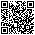
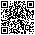

# Demo products for the jury

Six real, sealed products registered on **Solana devnet** by a company that Verifire verified. Use them to try the whole
flow on **https://verifire-solana.cosmosapp.lat** without installing anything and without a crypto wallet.

Batch `BATCH-300B38B803` · model **Ryzen 7700G** · lot `VF-2026-F185D883` · destination Argentina · LATAM.

## Try it in 2 minutes (no scanning needed)

Pick **one row** in the table. Each product can be activated **only once**, so if a row was already used, take the next one.

1. **Check the product (no account).** Click **Verify**. The page shows "Original product", the company that issued it,
   and the state **Sealed**.
2. **Activate the warranty.** Click **Activate** and sign in with any email (you get a one-time code). Your Solana wallet
   is created for you and Verifire pays the network fee. The warranty is registered on Solana in your name, with a link
   to the transaction on Solana Explorer.
3. **See the change.** Click **Verify** again: the product now shows as **Activated**, with its activation date and one
   owner.
4. **Try to cheat.** Click the same **Activate** link again, from another account or browser. The program refuses it,
   and the public page warns that the label may have been copied.

| Product | Verify (public QR) | Activate (secret QR) |
| --- | --- | --- |
| `VF-7PRY5U2K` | [Verify](https://verifire-solana.cosmosapp.lat/verify?token=VF-7PRY5U2K&lang=en) | [Activate](https://verifire-solana.cosmosapp.lat/app?lang=en#q=C8UGRD5fcN7Okw) |
| `VF-CHSKNVCB` | [Verify](https://verifire-solana.cosmosapp.lat/verify?token=VF-CHSKNVCB&lang=en) | [Activate](https://verifire-solana.cosmosapp.lat/app?lang=en#q=LDis_EyieJ84PA) |
| `VF-NNBWZKFB` | [Verify](https://verifire-solana.cosmosapp.lat/verify?token=VF-NNBWZKFB&lang=en) | [Activate](https://verifire-solana.cosmosapp.lat/app?lang=en#q=tuwqHMz4qBIRYg) |
| `VF-H9NQTE55` | [Verify](https://verifire-solana.cosmosapp.lat/verify?token=VF-H9NQTE55&lang=en) | [Activate](https://verifire-solana.cosmosapp.lat/app?lang=en#q=TcTKepY-m-SPlA) |
| `VF-3AKFFBMC` | [Verify](https://verifire-solana.cosmosapp.lat/verify?token=VF-3AKFFBMC&lang=en) | [Activate](https://verifire-solana.cosmosapp.lat/app?lang=en#q=Ugu9BUOQzuLk7A) |
| `VF-F9B3YRVD` | [Verify](https://verifire-solana.cosmosapp.lat/verify?token=VF-F9B3YRVD&lang=en) | Reserved for the team's demo recording |

## Prefer the real experience? Scan the QR codes

In a shop, the **public QR** is printed outside the box and the **secret QR** is hidden under a seal inside it. Open these
images on your computer and scan them with your phone camera, or upload the image at `/app` (it also accepts a screenshot
pasted with Ctrl + V).

| Product | Public QR (outside the box) | Secret QR (under the seal) |
| --- | --- | --- |
| `VF-7PRY5U2K` |  |  |
| `VF-CHSKNVCB` |  |  |
| `VF-NNBWZKFB` |  |  |
| `VF-H9NQTE55` |  |  |
| `VF-3AKFFBMC` |  |  |
| `VF-F9B3YRVD` |  | Reserved for the team |

## Good to know

- **One activation per product.** That is the point: a sealed code that was already used cannot make a second owner.
  There are five products for the jury, so each juror can take a different one.
- **Nothing to install, no crypto needed.** Signing in with an email creates the Solana wallet, and Verifire pays the fees.
- **Everything is on devnet**, Solana's public test network. No real money moves, and every certificate links to a real
  transaction on [Solana Explorer](https://explorer.solana.com/address/6a6EMSNxCrFzcLA38Q5WwcPWgyDPqdghaoaWhvHAEnj8?cluster=devnet).
- These codes are published on purpose, for the demo. A real company keeps the secret codes of its batches private.
